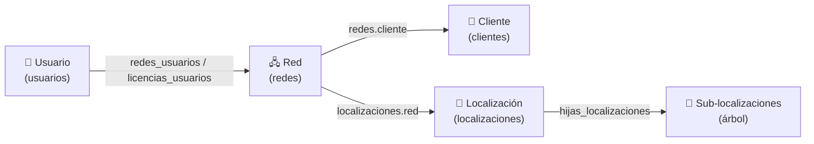

# Relaciones: Usuario ↔ Cliente ↔ Localización (EMIOS)

## Esquema general

**No hay relaciones directas**: todo pasa a través de la **Red** (`redes`).



## Modelo de datos real (MySQL)

### Tablas implicadas

| Tabla | Campos clave | Rol |
|---|---|---|
| `usuarios` | `id`, `nombre`, `perfil`, `idioma` | Usuario de la aplicación |
| `redes_usuarios` | `usuario`, `red` | Asignación directa usuario → red |
| `licencias_usuarios` | `usuario`, `licencia`, `red` | Licencias de módulos por usuario/red |
| `licencias` | `id`, `modulo`, `red`, `activada` | Qué módulos tiene cada red |
| `clientes` | `id`, `nombre` | Cliente (agrupación de redes) |
| `redes` | `id`, `nombre`, `cliente`, `zona_horaria`, `idioma` | Red / cliente gestionado |
| `localizaciones` | `id`, `nombre`, `red`, `descripcion`, `orden`, `latitud_mapa_defecto`, `longitud_mapa_defecto` | Ubicación / emplazamiento |
| `hijas_localizaciones` | `id`, `red`, `localizacion_padre`, `localizacion_hija` | Jerarquía (árbol) de localizaciones |

### Cadena de relaciones

```
usuarios ──┬─ redes_usuarios (usuario, red) ────────────┐
           └─ licencias_usuarios (usuario, licencia, red) │
                                                          ▼
                                                        RED (redes.id)
                                                          │
                          ┌───────────────────────────────┴──────────────────┐
                          │                                                   │
                  redes.cliente                                        localizaciones.red
                          │                                                   │
                          ▼                                                   ▼
                    CLIENTE (clientes.id)                            LOCALIZACIÓN (localizaciones.id)
                          │                                                   │
                    (agrupa redes)                                hijas_localizaciones (padre/hija)
                                                                          │
                                                                    ÁRBOL de localizaciones
```

## Explicación

### 1. Usuario → Cliente (indirecta, vía red)
- El usuario **no tiene columna de cliente**.
- Se relaciona con **redes** mediante:
  - `redes_usuarios (usuario, red)` — asignación directa de redes.
  - `licencias_usuarios (usuario, licencia, red)` + `licencias` — módulos licenciados por red.
- Cada **red** pertenece a un **cliente** (`redes.cliente → clientes.id`).
- **Resultado**: usuario → red → cliente.
- Un usuario puede tener acceso a varias redes, de uno o varios clientes.

### 2. Cliente → Localización (indirecta, vía red)
- El **cliente** (`clientes`: `id`, `nombre`) no tiene localizaciones directas.
- Tiene **redes** (`redes.cliente`).
- Cada **red** tiene **localizaciones** (`localizaciones.red → redes.id`).
- Las localizaciones se organizan en **árbol** (`hijas_localizaciones` con `localizacion_padre`/`localizacion_hija`).
- **Resultado**: cliente → red → localización (árbol).

## Cómo lo usa la aplicación

- Al iniciar sesión, el usuario elige una **red** (`$_SESSION["id_red"]`) de las que tiene asignadas.
- Todo lo que ve (localizaciones, sensores, activos…) se **filtra por esa red** (multi-tenant).
- Las localizaciones son el **emplazamiento** (dónde están los activos); pertenecen a una red, y la red al cliente.

## Reutilización para el inventario (Blazor)

- Este es el modelo exacto a reutilizar:
  - **usuario → red** (multi-tenant)
  - **red → localización** (árbol)
  - **cliente** = agrupación de redes.
- Los activos nuevos (`inv_activos`) apuntarían a `localizaciones.id`.
- El usuario de inventario elegiría la red/cliente y filtraría localizaciones y activos por esa red.
